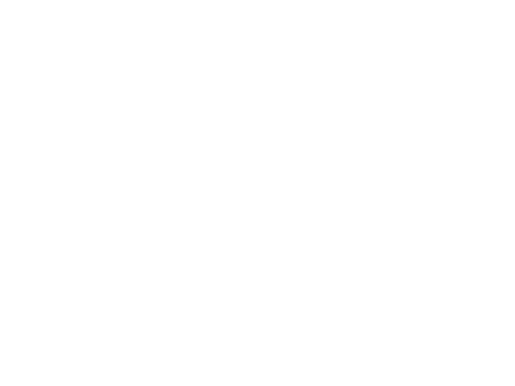

# LLM Reasoning Data Classification

**Trista Chen**  
CMPE 188 – Homework 3  
Due: May 4, 2026  

---

## 1. Introduction

In this project, I built and compared several machine learning pipelines for a text classification task. The goal was to categorize reasoning prompts into their corresponding `task_type` labels.

The dataset is derived from the NVIDIA Nemotron Model Reasoning Challenge and includes prompts along with annotated task types. The objective is to compare different combinations of text representation methods and machine learning algorithms, with an emphasis on both predictive performance and computational efficiency.

---

## 2. Data Preprocessing

I used the `prompt` column as the input text and `task_type` as the label. The text was converted into numerical features using TF-IDF.

The data was split into training and testing sets using an 80/20 ratio to evaluate model generalization. No additional normalization or stemming was applied, as TF-IDF sufficiently captured the textual patterns for this task.

---

## 3. Models and Pipelines

Three classification pipelines were implemented using TF-IDF as the text representation method:

- TF-IDF + Naive Bayes  
- TF-IDF + Support Vector Machine (SVM)  
- TF-IDF + Random Forest  

These models represent different approaches:
- Naive Bayes (probabilistic)
- SVM (margin-based)
- Random Forest (ensemble-based)

---

## 4. Results

| Model           | Accuracy | Training Time (s) | Inference Time (s) |
|-----------------|----------|-------------------|--------------------|
| Naive Bayes     | 1.00     | 0.022             | 0.0007             |
| SVM             | 1.00     | 0.096             | 0.0005             |
| Random Forest   | 1.00     | 0.240             | 0.016              |

All models achieved perfect classification performance on the test set.

### Accuracy Comparison

---

## 5. Analysis

All three models achieved identical performance metrics, with 100% accuracy, precision, recall, and F1-score. This suggests that the task is very easy to separate using TF-IDF features.

At first glance, the perfect accuracy might look like overfitting. However, the models also perform perfectly on the test set, so this is likely not traditional overfitting. Instead, it suggests that the dataset contains very strong patterns that clearly distinguish each class. For example, certain keywords or structures in the prompts appear to directly correspond to specific task types.

Even though all models performed equally well in terms of accuracy, their computational costs were different. Naive Bayes trained the fastest, while Random Forest took significantly longer without improving performance. SVM fell somewhere in between.

---

## 6. Conclusion

Based on these results, I would recommend Naive Bayes. It achieves the same accuracy as the other models but trains much faster, making it the most efficient option for this task.

Overall, the perfect accuracy across all models suggests that the dataset is relatively simple and contains highly distinguishable patterns. In a more complex or noisy dataset, the differences between models would likely be more noticeable.
